## Our Research Question

### 🚧 Why it matters
Road safety is a pressing issue in New South Wales, especially in high-traffic areas like Greater Sydney.  
Thousands of crashes occur every year,many resulting in serious injuries or fatalities.   
Understanding the key contributing factors is crucial for prevention and policy design.

### ❓ Can we predict crash severity?
Can we build a predictive model using time, location, road, weather, and vehicle data to classify NSW crashes into different severity levels?

### 🎯 Why it’s useful
- Identify high-risk zones.   
- Improve emergency response.     
- Support NSW's <strong>Vision Zero</strong> strategy to eliminate serious road trauma.

---
## From Raw Data to Rich Features

### 📦 Data Source  
We used official crash records from the [NSW Centre for Road Safety](https://data.nsw.gov.au/data/dataset/2-nsw-crash-data).     
The dataset includes crashes across New South Wales from 2019 to 2023.

### 🔗 Dataset Merging  
To enrich the features, we merged two datasets:    
– `nsw_crash_data` (incident-level crash records)    
– `nsw_vehicle_data` (details about vehicle types, usage, and involvement)  
This allows us to link each crash to detailed vehicle information.

### 🧠 Why merge the data?  
By combining crash and vehicle data, we gain access to more predictive features:    
– Vehicle type (car, motorcycle, truck...)    
– Number of vehicles involved    
These features help us better understand what factors are associated with crash severity.

---
##  Data Preprocessing

###1. Data Cleaning & Selection:
- Removed irrelevant (e.g., route, coordinates) and leakage-related variables (e.g., number killed)  
- Dropped redundant or high-missing (>90%) features

###2. Transformation & Encoding:
- Most categorical variables were mapped to integers&lt  
- Street type used label encoding (better for tree models)  
- Identifying feature type merged rare categories (40 → 16)

###3. Feature Engineering:
- Distance was right-skewed — handled by exponential binning to reduce noise  
- RUM & DCA codes were compressed to capture key road-type information

###4. Missing Value Imputation:
- Applied mode or zero filling depending on feature type&lt;  

### ✅ Result:
Cleaned dataset with 93,491 records and 36 features, ready for modeling.

---
## Exploring the Dataset Structure
###1. Target Variable Overview
   • Distribution of crash severity (5 classes)  
   • Class imbalance → evaluation challenge

  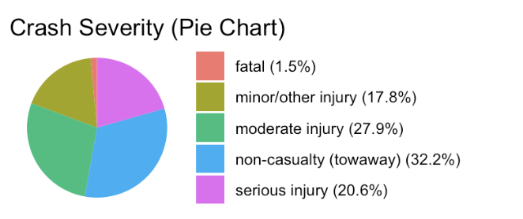

###2. Data Quality Check

  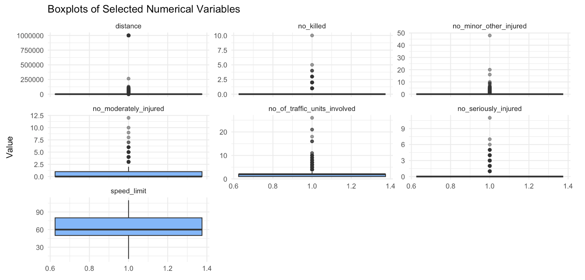

   • Missing values handled by mode imputation  
   • Boxplots reveal few outliers (distance, vehicle count)

###3. Frequency Patterns

  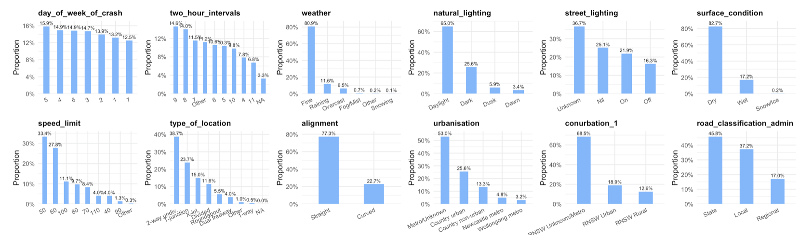

   • Most crashes: weekdays, daylight, afternoon/evening, Fine, moderate speed, urban, straight roads

---
## Feature Insights
### 1.Correlation Analysis
The correlation analysis was conducted across **numerical**, **categorical**, **boolean**, **contextual** to evaluate their association with crash severity.

  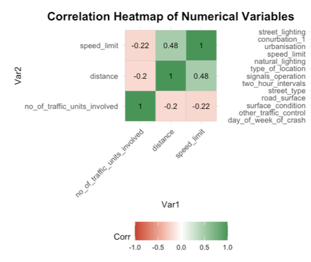
  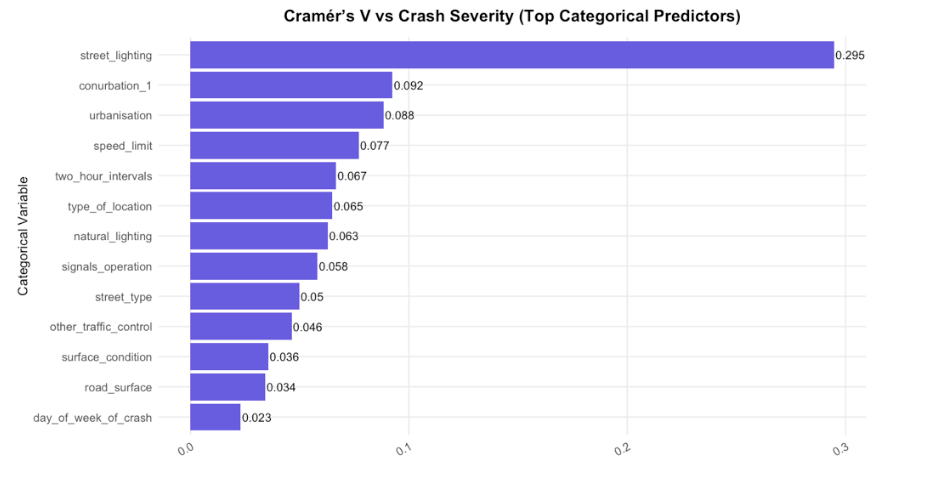
  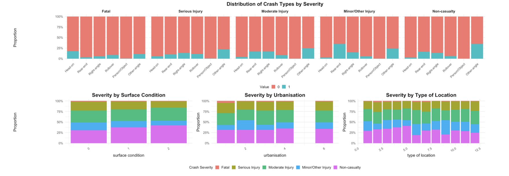

### 2.Feature-Outcome Relationship

  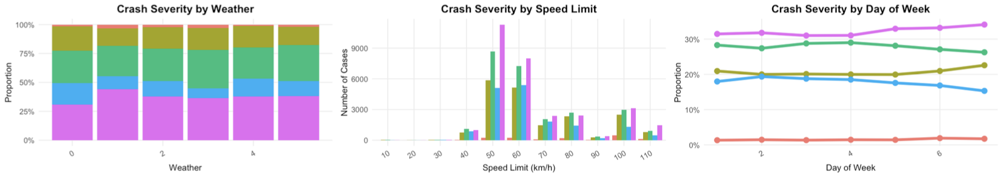
  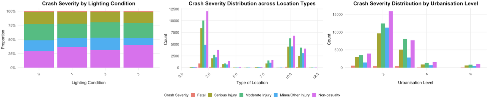

### 3.Dimension Reduction
 • Class clusters overlap in 2D → no clear boundary    
 • Need for **non-linear models** (RF, Boosting) to capture interactions

  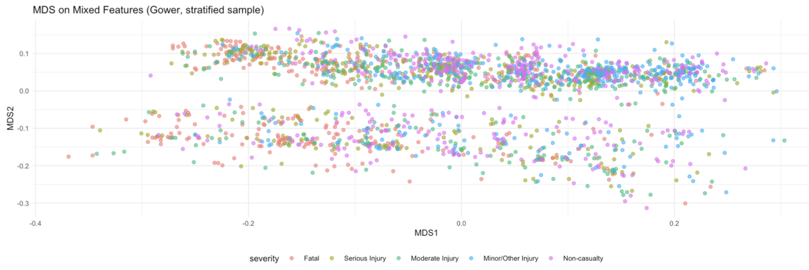

---
## Modelling Plan

### 1.Modelling Strategy
- Naive Bayes (Baseline, Probabilistic)   
- KNN (Instance-based)   
- Decision Tree (Interpretable Rules)   
- Random Forest (Bagging, Robustness)    
- Boosting (XGBoost/GBM, Frontier)

### 2.Evaluation Strategy
- Primary: Macro-F1 (balances rare vs common classes).  
- Supporting: Balanced Accuracy, per-class P/R, ROC-AUC.  
- Focus on error patterns in middle classes (Moderate/Minor) for discussion.

---
## Naive Bayes

### 1. Model Development

**Data Preparation:**  
- Missing values → filled with mode   
- Variables → converted to factors  
- Used stratified sampling (70/30) to maintain class balance 

**Tuning:**  
- 5-fold cross-validation tested Laplace (0–2) and usekernel (TRUE/FALSE).    
- Best = (Laplace = 0, usekernel = TRUE), but improvement small    
- kept Laplace = 1 baseline for clarity and consistency

### 2. Model Performance Overview
- Accuracy = 38.8% Kappa = 0.219  
- F1 (by class) = 0.55 (No Injury), 0.28 (Moderate), 0.11 (Fatal)   
- Macro AUC = 0.73   

  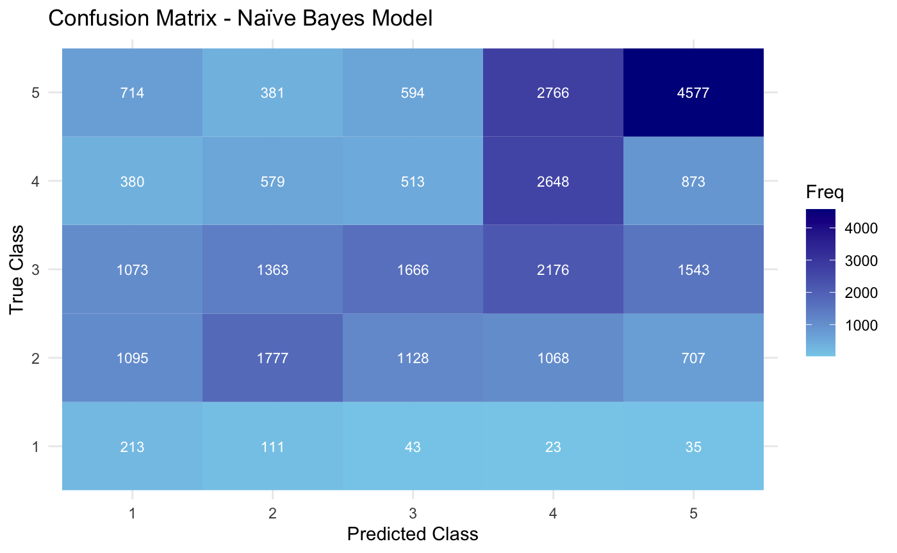
  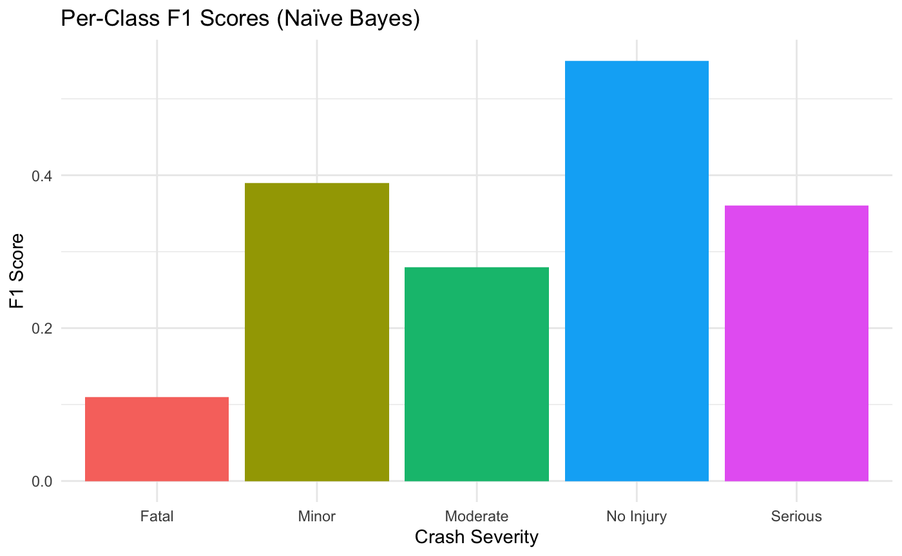
  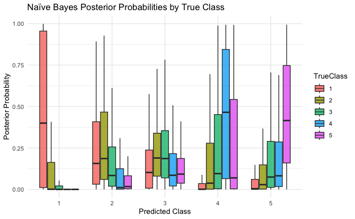

- Moderate accuracy overall, strongest on non-injury, weakest on fatal cases
---
## Naive Bayes

### 3.Insight  
- **Poor lighting** and **wet surface conditions** → higher severity risk.    
- Naïve Bayes captured **reasonable relationships** between environment and injury level.    
- Model is **simple** and **explainable — useful for interpreting patterns in crash data.  

### 4.Reflection & Future Work  

**Limitations**
- Mid-level classes → feature overlap → harder to separate    
- Naïve Bayes assumes feature independence    
- Class imbalance → bias toward common (non-injury) cases  

**Future Directions**
- Apply SMOTE / upsampling to balance classes    
- Try ensemble methods (e.g., Random Forest, XGBoost)    
- Add contextual features (e.g., road type, time of day)
---
## KNN

### 1. Model Development
#### 🎯 Why KNN
  I used K-Nearest Neighbors because it’s simple, non-parametric, and good at capturing local patterns without assuming a fixed model form.

#### 🧩 Data Preparation
Cleaned and standardized all variables before modeling.
  - Removed missing and inconsistent records.
  - Detected numeric outliers but kept valid extremes since they reflect real crashes.
  - Renamed and factorized the target variable, dropped IDs, and scaled all numeric predictors.
  - Applied PCA (95% variance) to remove noise and multicollinearity.

✅ The data was fully ready for modeling after preprocessing

#### 📊 Model Accuracy and Optimization
##### ===== Macro-Averaged Metrics (Final) =====
  - Accuracy: 42.53 %
  - Macro Precision: 0.398
  - Macro Recall: 0.335
  - Macro F1: 0.338
  - KNN model reached about 40% accuracy, which is reasonable for this imbalanced dataset.
##### Improved performance by:
  - Using 5-fold cross-validation to reduce random bias.
  - Tuning k (neighbors) for best validation accuracy and avoiding overfitting.
  - Applying PCA and scaling to refine distance metrics.
---
## KNN
🟦 Figure A – Crash Severity Distribution
  - This plot shows the class distribution of CrashSeverity, revealing a strong imbalance where minor crashes dominate.
  - Such skewness can bias KNN predictions toward the majority class, reducing accuracy if not addressed

🟦 Figure B – Outlier Distribution (Numeric Variables)
  - Boxplots of the ten most variable numeric features reveal several valid outliers representing rare crash conditions.
  - Their presence underscores the importance of scaling features to ensure fair distance comparisons in KNN.

🟩 Figure C – PCA Variance Explanation (Retain 95%)
  - The cumulative variance plot shows that the first r n_comp components retain 95% of total variance.
  - PCA reduces dimensionality and multicollinearity, improving KNN stability against high-dimensional effects.

🟥 Figure D – 5-Fold Cross Validation Accuracy (KNN)
  - Cross-validation results show stable performance across folds (≈40–43% accuracy).
  - The median-selected k = r final_k balances bias and variance under class imbalance.
  

  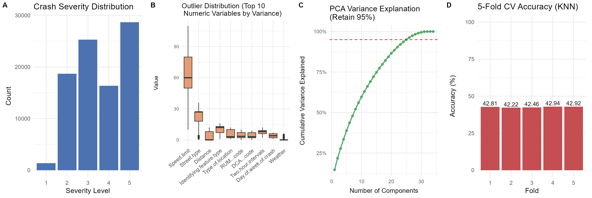

---
## KNN
🟦 Figure E – Confusion Matrix (Hold-Out Set, k = r final_k)
  - The heatmap shows KNN’s classification performance on test data.
  - Diagonal cells denote correct predictions; off-diagonal ones reveal confusion mainly between moderate and minor crashes.
  - Fatal and non-casualty classes remain more distinct, indicating stronger performance at the extremes.

🟨 Figure F – Per-Class Precision, Recall, and F1
  - This grouped bar chart summarizes precision, recall, and F1 for each crash-severity level.
  - Rare classes (e.g., fatal) show lower recall, while frequent ones achieve higher precision.
  
### Conclusion
  - The KNN model achieved moderate predictive performance, performing best on extreme crash severities but struggling with middle categories due to class imbalance and feature overlap.
  - Applying resampling, feature weighting, or advanced models could further enhance classification fairness and accuracy.

  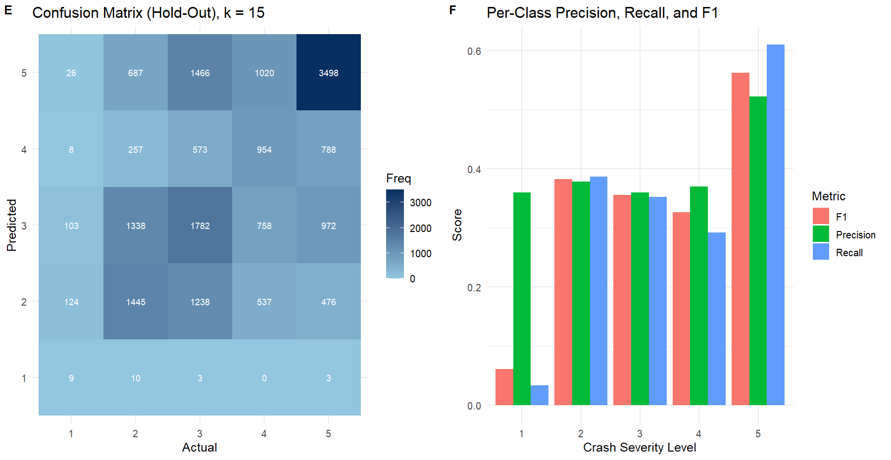

---
## Decision Tree
---
## Decision Tree
---
## Random Forest

### 1. Random Forest Overview

- **Ensemble method** → combines multiple decision trees  
- **Bagging** (Bootstrap Aggregation) → reduces overfitting  
- Captures **non-linear** patterns in complex datasets  
- **MDS** visualization confirmed non-linear feature relationships  
- **Robust & reliable** for crash severity classification with diverse factors

### 2. Model Development

- Target variable **highly imbalanced** (Fatal very rare) → Applied **upsampling** → balanced training data  
-	Trained RF: ntree=500, mtry≈5, importance=TRUE  

  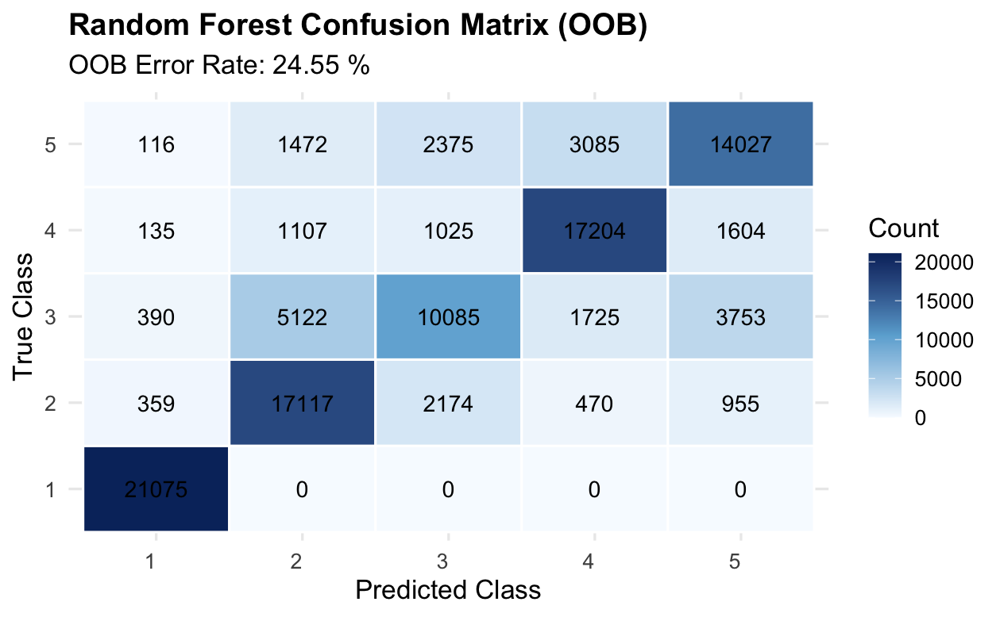
  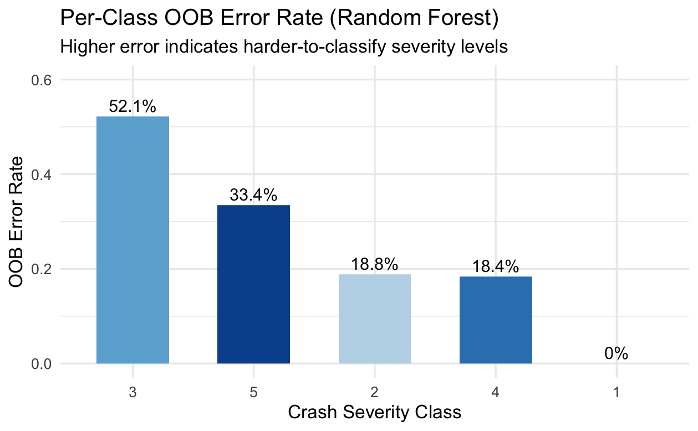

- **OOB error** = 24.55% → **stable overall**；Class errors → C3: 52.1%, C5: 33.4%, C2/C4: ~18%, C1: 0%  
- Strong on extremes (Fatal, Non-casualty), weak on mids (Moderate)  
-	**Insight** → mid-severity overlap remains  
- **Next** → richer features / cost-sensitive / tuning (mtry, nodesize)

---
## Random Forest

### 3. Model Evaluation

  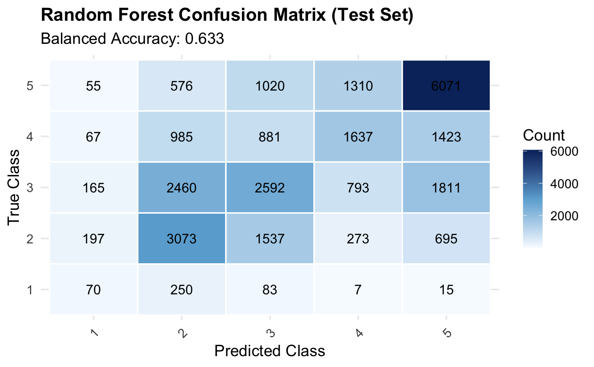
  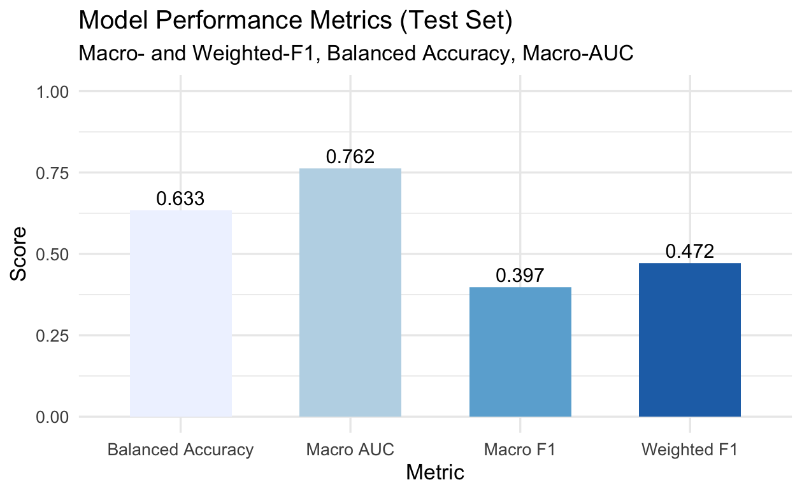

### 4. 3-fold Cross Validation

  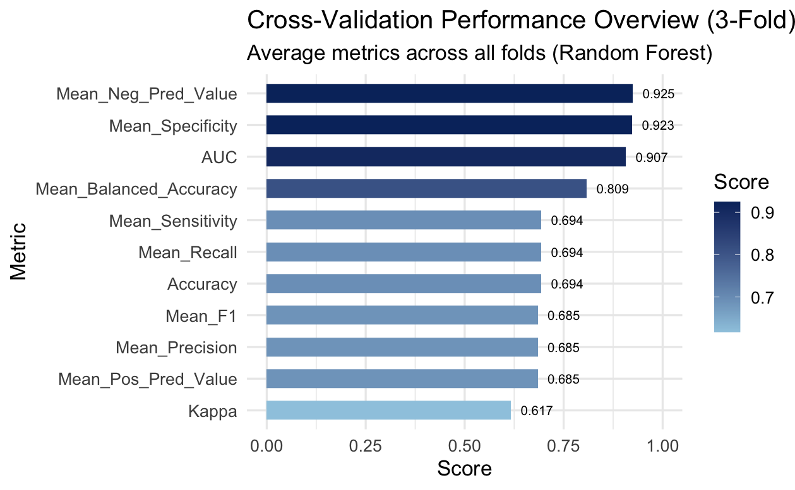

- Mid–severity (Moderate, Minor) → **still overlapping**  
- Confirms **robust & generalizable** performance  
- Test results are **stable**, **reliable**

---
## Random Forest

### 5. Variable Importance Analysis

  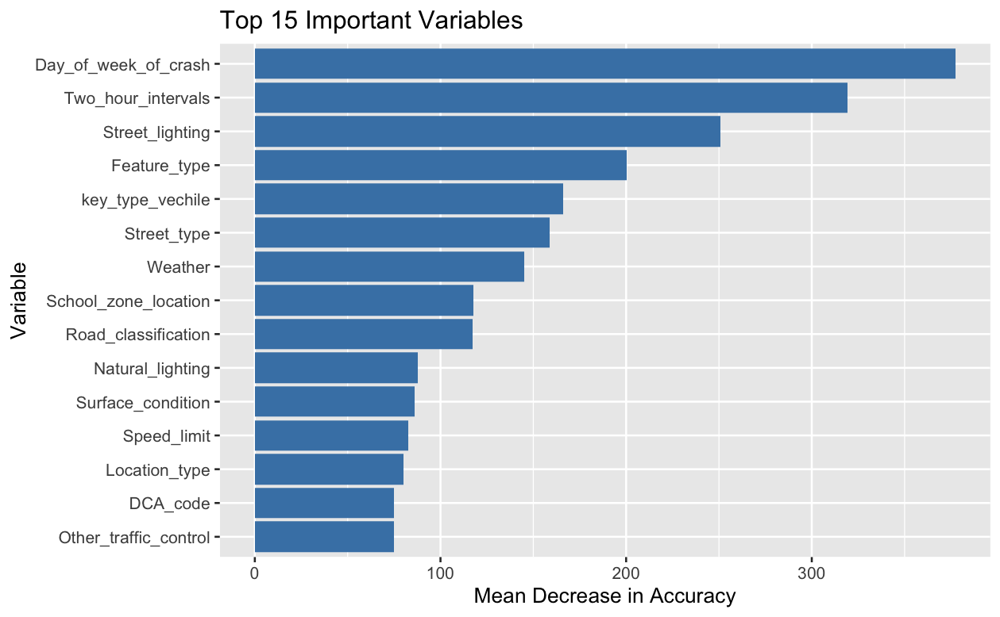

- Strong influence from **contextual & environmental** features  
- Indicates model captures **real-world** crash patterns

### 6.Reflection & Future Work

- Model achieved **moderate** but **stable** performance (Balanced Accuracy ≈ 0.63, Macro AUC ≈ 0.76)  
- Strength: handled **class imbalance** via oversampling  
- Limitation: confusion between **mid-severity** levels  
- Next steps:  
  a. Explore **XGBoost** for finer class boundaries  
	b. Add **richer contextual** features (driver, vehicle, response time)
	
---
## Boosting

### 1. Model development
- Grid search(with 5-fold cross-validation):  
- nrounds, max_depth, lr, gamma,   
- colsample_bytree(Fraction of features randomly sampled per tree)  
- min_child_weight(Minimum sum of instance weight in a child)  
- subsample(Fraction of samples randomly sampled per tree)  

- best parameter combination:nrounds=200, max_depth=7, eta=0.05, gamma=1, colsample_bytree=0.7, min_child_weight=3, subsample=0.7

---
## Boosting

### 2. Model performance

  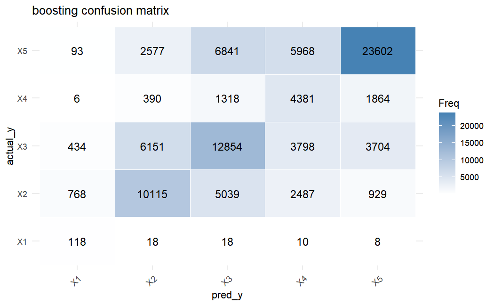
  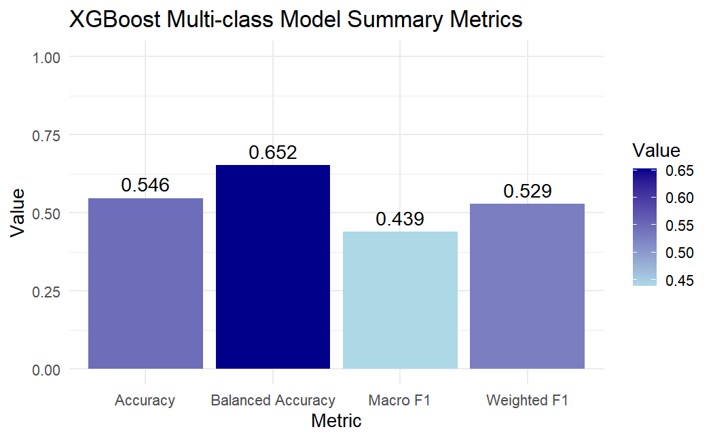
  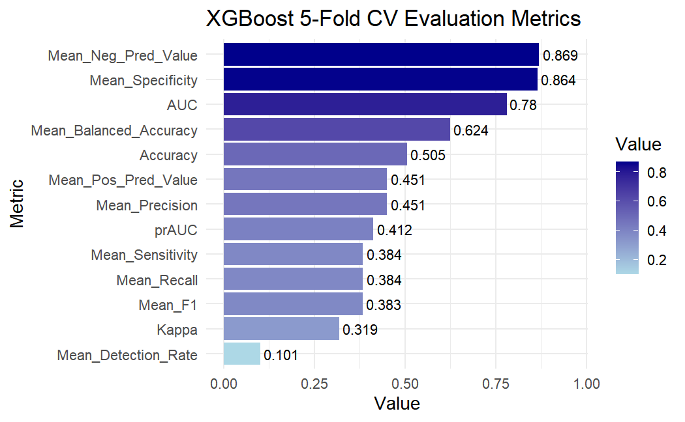

<strong>Moderate Overall Accuracy:</strong> The model achieves ~54.6% accuracy, better than random but far from high performance.

<strong>High-Frequency Bias:</strong> Class X5 dominates predictions (high recall, moderate precision), indicating the model favors the majority class.

<strong>Low-Frequency Underfitting:</strong> Minority classes (X1, X4) have extremely low recall, meaning most of their samples are misclassified.

<strong>Imbalanced Class Performance:</strong> Macro-F1 (0.439) is much lower than Weighted-F1 (0.529), reflecting uneven performance across classes.

<strong>Partial Strengths:</strong> Some precision is acceptable for low-frequency classes, and majority class predictions are reliable, but overall balance is poor.

---
## Model Performed Compared
---
## Final Insights & Future Work

